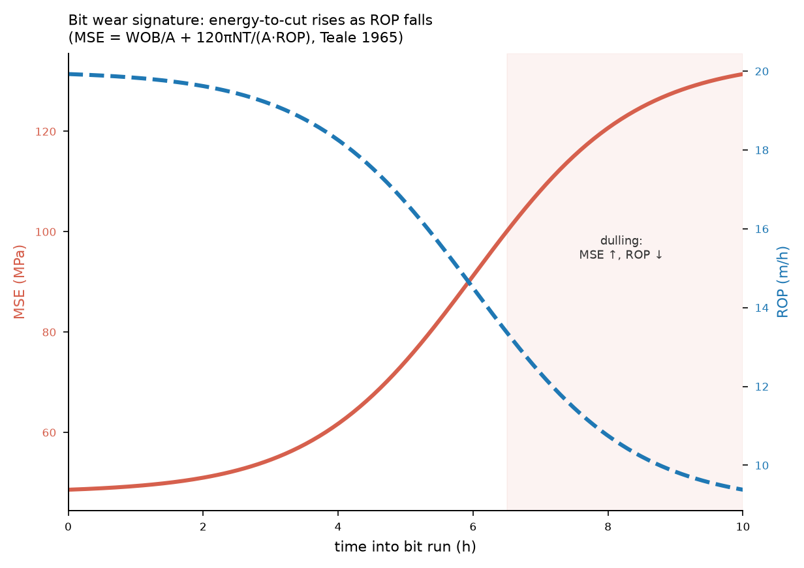

# CHAPTER TWO — LITERATURE REVIEW

---

## 2.1 Introduction

This chapter establishes the two bodies of knowledge on which the study rests. The first is the **physics
of drilling failure**: the governing relations that determine how each mechanism develops and what it
imprints on the measured channels. The second is the **literature on data-driven failure detection**,
against which the contribution of this work is positioned. The chapter is organised so that the physics
comes first and the models second, reflecting the study's premise that the physics determines what any
model can achieve.

§2.2 states the condition under which prediction is possible at all. §§2.3–2.9 treat each failure
mechanism. §2.10 draws out the parameter-interaction structure that follows from those mechanisms. §2.11
reviews data-driven detection methods, and §2.12 identifies the gap this study addresses.

## 2.2 The condition for predictability: separation of timescales

Whether a failure can be predicted is not a property of the algorithm applied to it but of the physical
process that produces it. A failure is predictable from measured data only if the process develops through
intermediate states that (i) leave a measurable signature in the available channels and (ii) evolve over a
time long compared with both the time needed to respond and the data sampling interval. Writing
$\tau_{\text{dev}}$ for the development time of the precursor, $\tau_{\text{resp}}$ for the response time,
and $\tau_{\text{sample}}$ for the sampling interval, prediction requires

$$\tau_{\text{dev}} \gg \tau_{\text{resp}} \gg \tau_{\text{sample}}$$

For real-time drilling data acquired at intervals of seconds, $\tau_{\text{sample}}$ is negligible; the
binding comparison is between $\tau_{\text{dev}}$ and $\tau_{\text{resp}}$. Where $\tau_{\text{dev}}$ is
tens of minutes to hours, an actionable warning is physically possible. Where $\tau_{\text{dev}}$
approaches $\tau_{\text{sample}}$, prediction degenerates into detection.

This condition is **necessary but not sufficient**. A slow process whose intermediate states leave no
distinguishable trace, or whose trace appears only simultaneously with the failure, provides no lead time
despite a long development. Both requirements — a long development time *and* a signature that leads the
event — must hold. The mechanism-by-mechanism review that follows establishes which failures satisfy both.

## 2.3 Hole cleaning and pack-off

Pack-off is the restriction of the annulus by accumulated drilled cuttings or cavings. It is governed by a
mass balance between the rate at which cuttings enter the annulus at the bit and the rate at which the
annular flow removes them. Cuttings are generated at

$$Q_{\text{gen}} = \text{ROP} \cdot A_{\text{hole}}$$

and transported at

$$Q_{\text{trans}} = (v_{\text{ann}} - v_{\text{slip}}) \cdot A_{\text{ann}} \cdot C$$

where $v_{\text{ann}}$ is the annular fluid velocity, $v_{\text{slip}}$ the settling velocity of a
cutting relative to the fluid, $A_{\text{ann}}$ the annular flow area, and $C$ the transport efficiency.
The dimensionless **transport ratio** $R_t = Q_{\text{trans}} / Q_{\text{gen}}$ then determines the
outcome: for $R_t \geq 1$ cuttings are removed as fast as they are produced; for $R_t < 1$ a bed
accumulates at a rate proportional to the deficit.

The slip velocity follows, in the low-Reynolds-number limit, the Stokes relation

$$v_{\text{slip}} = \frac{g\,d_p^2\,(\rho_s - \rho_f)}{18\,\mu}$$

so that heavier cuttings, larger particles and thinner muds all reduce transport efficiency. Experimental
work on cuttings transport established the controlling variables and, importantly, the strong effect of
hole inclination: in the 30–60° range cuttings beds form readily and are difficult to remove, because the
gravitational component normal to the wellbore axis promotes settling while the axial flow does little to
re-entrain the settled material (Sifferman et al., 1974; Tomren, Iyoho & Azar, 1986).

The consequences of an accumulating bed are the observable signature. A reduced annular flow area raises
frictional pressure loss, so **equivalent circulating density and standpipe pressure both rise**;
mechanical interaction between the bed and the rotating string raises **torque and drag**. Because bed
growth is gradual — accumulating over tens of minutes to hours — pack-off satisfies both conditions of
§2.2 and is among the most predictable of drilling failures. It is also the mechanism whose signature is
most strongly *multivariate*: a single physical cause perturbs several channels simultaneously and in a
characteristic correlated pattern, which is precisely the structure that multichannel monitoring can
exploit.

## 2.4 Bit wear and drilling efficiency

The energy required to remove rock provides a direct measure of bit condition. Teale (1965) defined the
**mechanical specific energy** as the work done per unit volume of rock destroyed, comprising an axial and
a rotary contribution:

$$\text{MSE} = \frac{\text{WOB}}{A_b} + \frac{120\pi\,N\,T}{A_b \cdot \text{ROP}}$$

with WOB the weight on bit, $A_b$ the bit face area, $N$ the rotary speed, $T$ the torque and ROP the rate
of penetration. Teale further observed that in efficient drilling MSE approaches the compressive strength
of the rock; in practice, values of roughly 1.5–2 times the unconfined compressive strength indicate
efficient operation, while substantially higher values indicate energy being dissipated other than in
rock destruction.

As a bit dulls, more energy is required per unit volume removed: at fixed WOB and rotary speed, ROP falls
and torque rises, so **MSE increases progressively**. Dupriest & Koederitz (2005) developed this into a
real-time surveillance method, using MSE trends to distinguish efficient drilling from *founder* — the
condition in which further increases in applied energy produce no additional penetration. Because bit
dulling proceeds over hours, it offers among the longest lead times of any mechanism considered here, and
its signature (rising MSE with falling ROP at constant input) is unambiguous provided formation change is
excluded as a confounder. That exclusion requires a formation-context channel such as gamma ray: an
increase in rock strength produces a similar MSE signature without any deterioration of the bit.

## 2.5 Pore pressure and the drilling exponent

Drilling response also carries information about the formation being drilled. Jorden & Shirley (1966)
introduced the **d-exponent**, a normalised measure of drillability:

$$d = \frac{\log_{10}\!\left(\dfrac{\text{ROP}}{60N}\right)}{\log_{10}\!\left(\dfrac{12\,\text{WOB}}{10^6 D}\right)}$$

with $D$ the bit diameter. Under normal compaction, increasing depth brings increasing rock strength and
the exponent rises steadily. Entry into an abnormally pressured formation reverses this: the pore fluid
supports part of the overburden, the rock is less compacted than its depth would suggest, drillability
improves, and the exponent departs downward from the established trend. Rehm & McClendon (1971) corrected
the exponent for mud weight, giving

$$d_c = d \cdot \frac{\rho_{\text{normal}}}{\rho_{\text{actual}}}$$

which removes the confounding effect of mud-weight changes and makes the departure from trend
interpretable as a pore-pressure indicator.

## 2.6 Well control and kick detection

A kick begins when the pore pressure exceeds the wellbore pressure at some depth and formation fluid
enters the well:

$$P_{\text{pore}} > P_{\text{wellbore}} = 0.052 \cdot \text{ECD} \cdot \text{TVD}$$

The classical indicators — flow out exceeding flow in, pit-volume gain, a drilling break, a standpipe
pressure fall, rising gas readings — appear **as the influx begins**, not before it. The transition from
overbalance to underbalance may itself be gradual, but the observable signature is not: it coincides with
the event. Consequently kicks admit no precursor waveform leading the event by tens of minutes, and the
defensible objective is **minimising detection latency** rather than prediction. This is consistent with
the emphasis of the well-control literature on early *detection* and automated response to an influx
already under way (Olamigoke & James, 2022).

## 2.7 Differential and mechanical sticking

Differential sticking occurs when the drill string rests against a permeable formation and the pressure
differential between wellbore and pore fluid acts over the contact area:

$$F_{\text{stick}} = \Delta P \cdot A_{\text{contact}} \cdot f, \qquad \Delta P = P_{\text{wellbore}} - P_{\text{pore}}$$

The force grows with overbalance, with contact area — itself increasing as filter cake builds and the
string embeds — and with stationary time. This mechanism is physically distinct from those above in an
important respect. The overbalance and the contact geometry that make sticking likely are measurable and
evolve slowly, so the **risk** is observable; but the moment at which the string actually becomes
immobilised is not signalled in advance by any channel. The condition builds observably while its
realisation remains unpredictable in time.

The appropriate output for such a mechanism is therefore an evolving **risk state** rather than a timed
forecast. Mechanical sticking — from keyseats, ledges, undergauge hole or collapsed formation — shares
this character: the geometry that permits it can be inferred, but the event occurs when the string is
moved into the restriction.

## 2.8 Lost circulation

Circulation is lost when the wellbore pressure exceeds the formation fracture gradient, or when the well
intersects an existing high-permeability path:

$$\text{ECD} > \text{FG}$$

where the equivalent circulating density combines the static mud weight with the annular friction
contribution,

$$\text{ECD} = \rho_{\text{mud}} + \frac{\Delta P_{\text{ann}}}{g \cdot \text{TVD}}$$

Two regimes follow, with different predictability. Where ECD creeps upward — through cuttings loading,
increased flow rate, or narrowing annulus — the approach to the fracture gradient is gradual and
observable in advance. Where the bit intersects a natural fracture or cavern, losses begin abruptly with
no leading signature. Lost circulation is therefore a **mixed** case, and reporting a single
predictability for it would misrepresent one regime or the other.

## 2.9 Wellbore instability

The stress concentration around a circular opening in a stressed medium is described by the Kirsch
solution; failure occurs where the induced stresses exceed the rock's strength envelope, commonly
represented by a Mohr–Coulomb criterion. Insufficient mud weight permits shear failure of the wall and
inward movement or breakout; excessive mud weight induces tensile failure. Between these lies the
operating window bounded below by the collapse pressure and above by the fracture gradient.

Shale instability has an additional time dependence: chemical interaction between mud and clay, and
pore-pressure diffusion into low-permeability rock, allow failure to develop over hours after a section is
drilled. The observable consequences are cavings production, an over-gauge hole, increased torque and
drag, and — where cavings load the annulus — the pack-off signature of §2.3. Mechanical earth models
constructed from log and offset data are used to establish the safe mud-weight window for a given
formation and stress state, and have been applied for wellbore-stability analysis in Niger Delta fields
(Adegbamigbe, Olamigoke & Lawal, 2020). The mechanism is partially predictable: slow creep provides lead
time, brittle collapse may not, and the most direct confirming measurements — caliper logs and cavings
observation — are frequently unavailable in real-time data.

## 2.10 The parameter-interaction structure implied by the physics

Read together, §§2.3–2.9 establish a structural result that motivates this study. The monitored parameters
are not independent observations of separate phenomena: they are coupled responses of a single
hydraulic–mechanical system, and each failure mechanism perturbs a characteristic subset of them in a
characteristic pattern.

Three consequences follow.

**First, most channels are diagnostically ambiguous in isolation.** Rising torque is consistent with a
developing pack-off, with increased bit aggressiveness, with wellbore tortuosity, or with a change in
formation. It acquires meaning only in relation to other channels: with WOB, rotary speed and ROP it
describes drilling efficiency; with standpipe pressure and ECD it describes annular condition. A small
number of channels are exceptions — torsional-vibration measurements such as a stick-slip index describe
a specific mechanism directly and are meaningful alone.

**Second, one physical cause produces several correlated responses.** A developing pack-off raises ECD,
standpipe pressure, torque and drag together. Agreement between channels that the physics predicts should
respond together is therefore evidence about the mechanism, not redundancy — which is the basis for
treating multichannel confirmation as increased confidence.

**Third, rig state governs which physics applies.** Time-indexed drilling data contains long intervals in
which no hole is being made — connections, tripping, circulating without rotation. During a connection the
rate of penetration falls to zero and depth ceases to advance, but this reflects the operation being
performed rather than any developing failure. Channels describing rig state — block position, flow, hook
load, bit and hole depth — therefore function as *context*: they determine which mechanism physics is
valid at a given moment, and features such as MSE are undefined where ROP approaches zero.

## 2.11 Data-driven detection of drilling failures

Machine-learning approaches to drilling-failure detection have developed rapidly. Alshaikh et al. (2019)
applied data analytics to stuck-pipe incident detection using historical drilling records. Mal et al.
(2022) used deep-learning models for stuck-pipe prediction, and Inoue et al. (2023) applied a
graph-attention architecture to early stuck-pipe detection, using the learned attention structure to
represent relationships between channels. Al-Mamoori, Tian & Ma (2025) report a deep-learning approach to
stuck-pipe detection in drilling operations. Work on the Volve dataset specifically has shown that
machine-learning methods can predict well quantities from it as time series (Olamigoke & Onyeali, 2022).

Three method families recur, and they differ in the kind of departure they detect.

**Supervised classification** — random forests, gradient boosting, support-vector methods — learns a
decision boundary between labelled normal and abnormal operating points. It detects *point* deviation:
whether the current multivariate state resembles states previously labelled as failures. Its dependence
on labels is also its limitation, since documented failure events are scarce.

**Unsupervised sequence models** — most commonly autoencoders over recurrent or LSTM layers — are trained
to reconstruct normal behaviour and score anomalies by reconstruction error (Nguyen, Tran & Thomassey,
2020). They detect *temporal* deviation: a trend departing from learned dynamics. They require no failure
labels, which suits a domain where labels are scarce, and they are well matched to precursors that are
gradual and correlated.

**Shape-based matching** — chiefly dynamic time warping, with the Sakoe–Chiba band restricting the warping
path (Sakoe & Chiba, 1978) — compares a window against reference templates under elastic time alignment.
It detects *shape* similarity: whether the recent trajectory resembles a known signature, irrespective of
its exact duration. It is well suited to mechanisms whose physics predicts a characteristic waveform.

That these three detect structurally different departures is the reason for combining them, and the
distinction is physical rather than statistical: point, trend and shape correspond to genuinely different
classes of signature in the drilling data.

## 2.12 Gap in the literature

Three limitations recur across the works reviewed.

**The physics is often implicit.** Models are trained on raw channels or generic statistical features,
without deriving why those inputs should be informative. A model achieving high accuracy on one dataset
thereby offers no account of its own transferability, and no physical explanation to justify acting on its
alerts.

**Prediction and detection are not consistently distinguished.** The mechanisms reviewed above differ
fundamentally: bit wear and pack-off develop observably over long periods; differential sticking builds an
observable risk whose timing is unsignalled; kicks announce themselves only as they begin. Reporting a
single predictive capability across these conflates categories and overstates what is achievable.

**The sensor set is treated as fixed.** Multivariate models exploit channel correlations implicitly, in
learned weights, without establishing which correlations are physically meaningful, which channels are
individually diagnostic, or what minimum set of measurements renders a mechanism observable. When a
channel is unavailable — routine, since sensors fail and rigs differ in equipment — such a model either
cannot run or runs on degraded input without declaring that its diagnostic reach has narrowed.

This study addresses these three gaps in order: it derives the mechanism physics first (§§2.3–2.9),
classifies mechanisms by what their physics permits, and derives from the mechanism–channel relationships
an explicit account of what a given set of parameters can and cannot observe. The three method families of
§2.11 are then applied as complementary instruments matched to the point, trend and shape signature
classes the physics identifies.

---

## References

Adegbamigbe, T., Olamigoke, O. & Lawal, K.A. (2020) *Application of a 1-D Mechanical Earth Model for
Wellbore Stability Analysis in a Shallow-Water Field, Niger Delta.* SPE Nigeria Annual International
Conference and Exhibition. DOI: 10.2118/203632-ms

Al-Mamoori, S.K., Tian, S. & Ma, T. (2025) *Stuck Pipe Detection in Oil and Gas Drilling Operations Using
Deep Learning.* Applied Sciences. DOI: 10.3390/app15095042

Alshaikh, A., Magana-Mora, A., Gharbi, S. & Al-Yami, A. (2019) *Machine Learning for Detecting Stuck Pipe
Incidents: Data Analytics.* IPTC. DOI: 10.2523/iptc-19394-ms

Dupriest, F.E. & Koederitz, W.L. (2005) *Maximizing Drill Rates with Real-Time Surveillance of Mechanical
Specific Energy.* SPE/IADC Drilling Conference. DOI: 10.2523/92194-ms

Inoue, K., Nakagawa, Y., Kaneko, T. & Wada, R. (2023) *Early Stuck Pipe Detection Using Graph Attention
Machine Learning.* OMAE. DOI: 10.1115/omae2023-101928

Jorden, J.R. & Shirley, O.J. (1966) *Application of Drilling Performance Data to Overpressure Detection.*
Journal of Petroleum Technology. DOI: 10.2118/1407-pa

Mal, S., Ødegård, S., Helgeland, S. & Sinaga, Z. (2022) *Prediction of Stuck Pipe Incidents Using Models
Powered by Deep Learning.* SPE. DOI: 10.2118/208778-ms

Nguyen, H.D., Tran, K.P. & Thomassey, S. (2020) *Forecasting and Anomaly Detection approaches using LSTM
and LSTM Autoencoder techniques.* International Journal of Information Management. DOI:
10.1016/j.ijinfomgt.2020.102282

Olamigoke, O. & James, I. (2022) *Advances in Well Control: Early Kick Detection and Automated Control
Systems.* IntechOpen. DOI: 10.5772/intechopen.106800

Olamigoke, O. & Onyeali, D.C. (2022) *Machine learning prediction of bottomhole flowing pressure as a time
series in the Volve field.* International Journal of Frontiers in Engineering and Technology Research,
2(2). DOI: 10.53294/ijfetr.2022.2.2.0039

Rehm, B. & McClendon, R. (1971) *Measurement of Formation Pressure from Drilling Data.* SPE. DOI:
10.2118/3601-ms

Sakoe, H. & Chiba, S. (1978) *Dynamic programming algorithm optimization for spoken word recognition.*
IEEE Transactions on Acoustics, Speech and Signal Processing. DOI: 10.1109/tassp.1978.1163055

Sifferman, T.R., Myers, G.M. & Haden, E.L. (1974) *Drill Cutting Transport in Full Scale Vertical Annuli.*
Journal of Petroleum Technology. DOI: 10.2118/4514-pa

Teale, R. (1965) *The concept of specific energy in rock drilling.* International Journal of Rock
Mechanics and Mining Sciences. DOI: 10.1016/0148-9062(65)90022-7

Tomren, P.H., Iyoho, A.W. & Azar, J.J. (1986) *Experimental Study of Cuttings Transport in Directional
Wells.* SPE Drilling Engineering. DOI: 10.2118/12123-pa
