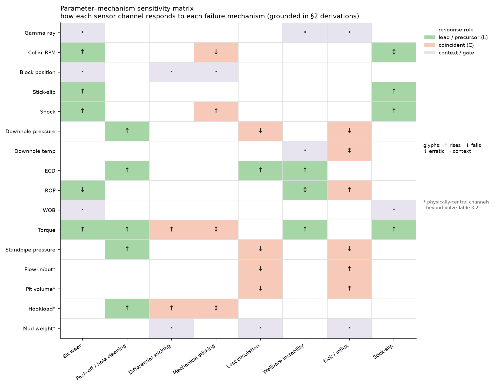
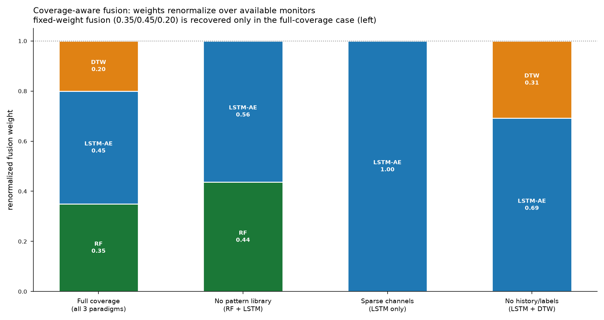

# CHAPTER THREE — METHODOLOGY

---

## 3.1 Introduction and research design

The study proceeds in a deliberate order: the physics is established and verified first, and only then are
models applied. This ordering is methodological rather than presentational. Because the physics determines
which mechanisms admit prediction, what each feature measures, and which channels can observe which
mechanism, establishing it first means every subsequent modelling choice can be justified physically —
and any model output that contradicts the physics can be recognised as an error rather than a discovery.

Five stages follow. §3.2 derives the physical features and verifies them dimensionally. §3.3 constructs the
parameter–mechanism sensitivity map and the minimum observable sets. §3.4 establishes the data conventions
and rig-state gating rules. §3.5 formulates the three models and their coverage-aware fusion. §3.6 defines
the evaluation, including the ablation design that produces the latency result.

## 3.2 Derivation and dimensional verification of physical features

Twelve features translate raw measured channels into mechanism-relevant physical quantities. Each is
implemented in both **field** and **SI** forms, since the governing relations appear in the literature in
field units while the Volve dataset is metric.

| # | Feature | Physical meaning | Mechanism informed |
|---|---|---|---|
| 1 | Mechanical specific energy | energy per unit rock volume removed | bit wear, founder |
| 2 | d-exponent | normalised drillability | pore pressure |
| 3 | Corrected exponent $d_c$ | drillability, mud-weight corrected | overpressure |
| 4 | Equivalent circulating density | dynamic pressure as density | pressure window |
| 5 | ECD margin | distance to fracture gradient | losses, instability |
| 6 | Transport ratio | cuttings removed / cuttings generated | hole cleaning |
| 7 | Slip velocity | cutting settling velocity | hole cleaning |
| 8 | Annular velocity | mean annular fluid velocity | hole cleaning |
| 9 | Overbalance | wellbore minus pore pressure | differential sticking |
| 10 | Sticking force | overbalance force on contact area | differential sticking |
| 11 | Stick-slip index | torsional-vibration severity | stick-slip |
| 12 | Hydraulic horsepower | power delivered at the bit | bit hydraulics |

**Dimensional verification.** Each relation is checked symbolically by reducing both sides to the base
dimensions of mass, length and time and asserting equality. This is implemented with a computer-algebra
system and executed as a self-test whenever the feature module is loaded, so a unit error cannot enter the
pipeline silently. All checks pass. Representative results:

| Relation | Reduces to | Expected |
|---|---|---|
| Cuttings generation and transport rates | $L^3 T^{-1}$ | volumetric flow ✓ |
| Transport ratio | dimensionless | ✓ |
| Slip velocity | $L T^{-1}$ | velocity ✓ |
| ECD annular term | $M L^{-3}$ | density ✓ |
| Sticking force | $M L T^{-2}$ | force ✓ |
| MSE, both terms | $M L^{-1} T^{-2}$ | pressure ✓ |

**Numerical cross-validation.** Beyond dimensional consistency, the field and SI implementations are
evaluated on the same physical state and required to agree. For mechanical specific energy the two forms
agree to within 0.4 %, confirming the unit conversions. A representative efficient-drilling state returns
MSE ≈ 1.7 times the unconfined compressive strength of the rock, within the 1.5–2 range Teale's
formulation predicts for efficient operation — an independent check that the implementation reproduces
known physical behaviour.

**Corrections to published forms.** Three errors in the formulations initially adopted for this work were
identified and corrected during verification: downhole pressure had been expressed in pounds per gallon, a
density unit, and is correctly expressed in pressure units, with pounds per gallon reserved for mud weight
and ECD; the d-exponent expression contained transcription errors in both numerator and denominator; and
the MSE expression did not reduce to Teale's form. Each was corrected against the primary source and
re-verified.

## 3.3 The parameter–mechanism sensitivity map

The physics of Chapter Two predicts, for each mechanism, which channels respond, in which direction, and
whether the response *leads* the failure or merely accompanies it. These predictions are assembled into a
sensitivity matrix over sixteen channels and eight mechanisms.

**Encoding.** Each cell records the direction of response — increase, decrease, or either — together with
its temporal role: **leading** (the channel moves before the event, so prediction is possible),
**coincident** (the channel moves as the event occurs, supporting detection only), or **context** (the
channel does not indicate the mechanism but conditions whether its physics applies).

**Channel clusters.** The sixteen channels group into four physical clusters, which is why the matrix is
structured rather than arbitrary: *mechanical* (weight on bit, rotary speed, torque, rate of penetration,
stick-slip, shock), *hydraulic* (standpipe pressure, ECD, downhole pressure, flow, mud weight, pit
volume), *formation* (gamma ray, downhole temperature), and *rig state* (block position, hook load). Each
mechanism draws principally on one cluster, with rig-state channels acting across all as gates.

**Minimum observable sets.** From the matrix, the smallest set of channels that makes each mechanism
detectable is derived. These sets are the formal basis of the composable framework: given any selected
subset of channels, the observable mechanisms are exactly those whose minimum observable set is contained
in the selection, and the remainder are explicitly unobservable.

| Mechanism | Minimum observable set | Size |
|---|---|---|
| Stick-slip | stick-slip index alone | 1 |
| Kick / influx | flow in/out, pit volume | 2 |
| Pack-off | ECD, standpipe pressure, torque | 3 |
| Differential sticking | overbalance, hook load, rig state | 3 |
| Mechanical sticking | torque, hook load, rig state | 3 |
| Lost circulation | flow in/out, pit volume, ECD | 3 |
| Wellbore instability | torque, drag, ECD *(partial — caliper and cavings unavailable)* | 3 |
| Bit wear | weight on bit, rotary speed, torque, rate of penetration | 4 |

Two results from this construction bear on the study's claims. First, **stick-slip is the only mechanism
observable from a single channel** — the torsional-vibration measurement is self-diagnostic, whereas
torque, standpipe pressure and ECD are relational and near-uninformative alone. Second, the mechanisms
classified in Chapter Two as risk-state or detection-only carry **zero leading channels**, which
independently confirms that classification from the matrix rather than by assertion.

## 3.4 Data source, conventions and rig-state gating

**Dataset.** The study uses the public Equinor Volve dataset from block 15/9 (licence PL 046) on the
Norwegian Continental Shelf, comprising well logs, drilling records and real-time surface measurements for
wells of the 15/9-F series. Real-time drilling data are time-indexed at intervals of seconds. The specific
wellbore analysed is identified from the file headers rather than assumed.

**Unit conventions.** Volve is a metric dataset: depths in metres, penetration rate in metres per hour,
pressures in bar or kilopascals, mud weight in specific gravity or kilograms per cubic metre. The SI
feature forms of §3.2 are therefore the primary implementation, with the field forms retained for
cross-checking. Each channel's unit is read from its header rather than inferred.

**Rig-state gating.** Because the data is time-indexed rather than depth-indexed, it contains extended
intervals in which no hole is being made. At every pipe connection the rate of penetration falls to zero
and bit depth ceases to advance — a consequence of the operation being performed, not of any developing
failure. Two errors follow if this is ignored: an ungated model raises an alarm at every connection, and
MSE diverges as ROP approaches zero.

A boolean mask is therefore constructed from the rig-state channels, requiring circulation (flow above
threshold), the bit on bottom (hole depth minus bit depth within tolerance) and hole being made. Mechanism
features are computed only where this mask holds, and the fraction of samples retained is reported as a
data-quality measure. This is the operational meaning of treating rig-state channels as context: they
determine which physics is valid before any feature is evaluated.

**Quality control.** Each feature carries a valid physical range. Values outside it are flagged as
**sensor faults rather than failures**, since a physically impossible reading indicates a measurement
problem. Before modelling, the computed features are checked against known physical behaviour: MSE in
efficient intervals near the expected multiple of rock strength, ECD at or above mud weight by a plausible
friction margin, and $d_c$ rising with depth under normal compaction.

## 3.5 Model formulation and coverage-aware fusion

Three models are applied, each matched to one of the signature classes identified in §2.11.

**Random Forest — point classification.** An ensemble of decision trees over the per-sample feature
vector, detecting whether the current multivariate operating point resembles states labelled abnormal.
Output is a score $S_{\text{RF}} \in [0,1]$.

Labels follow a stated hierarchy, in descending preference: documented failure events with timestamps;
physics-consistency labels, requiring that *several independent features cross their thresholds together in
the correlated pattern the mechanism predicts*; and, failing both, weak heuristic labels declared as such.
The requirement of correlated multi-feature crossing is what distinguishes a physics-consistency label from
an arbitrary threshold. An anti-circularity rule applies throughout: **evaluation never reuses the rule
that generated the labels**, since a model tested against its own labelling criterion measures only its
own consistency.

**LSTM autoencoder — temporal anomaly.** A recurrent encoder–decoder trained on *normal* sequences only,
so that reconstruction error scores departure from learned dynamics. The window length is set from the
development timescale of the target mechanism rather than by convention, since a window shorter than
$\tau_{\text{dev}}$ cannot represent the precursor it is meant to detect. Output is a normalised score
$S_{\text{LSTM}} \in [0,1]$.

**Dynamic time warping — shape matching.** Recent windows are compared against reference templates under
elastic time alignment with a Sakoe–Chiba band constraining the warping path. The **provenance of the
templates is a methodological requirement, not an implementation detail**: templates derive from the
mechanism physics of Chapter Two — the correlated ECD, standpipe-pressure and torque ramp of a developing
pack-off; the rising-MSE, falling-ROP crossover of a dulling bit — or from documented events. They are
never seeded from windows flagged by the autoencoder, since doing so would make the shape score a
re-encoding of the anomaly score, destroying the independence on which combining them depends. Output is
$S_{\text{DTW}} \in [0,1]$.

**Coverage-aware fusion.** The three scores combine into a single risk score, weighted and renormalised
over the monitors actually available:

$$\text{Risk}(t) = 100 \cdot \frac{\sum_{k \in \mathcal{A}(t)} w_k\,S_k(t)}{\sum_{k \in \mathcal{A}(t)} w_k}$$

where $\mathcal{A}(t)$ is the set of active monitors at time $t$ and the base weights are
$w_{\text{RF}} = 0.35$, $w_{\text{LSTM}} = 0.45$, $w_{\text{DTW}} = 0.20$.

Two properties matter. When all three monitors are active, the expression reduces exactly to the fixed
weighting — so the fixed-weight formulation is the *full-coverage special case* of the general one. When a
monitor is unavailable, the remaining weights renormalise, keeping the score on a 0–100 scale and
interpretable under reduced instrumentation rather than silently degraded.

The weighting itself is a physical statement rather than a tuned constant. The heaviest weight rests on the
sequence model because the mechanisms with the longest lead times — pack-off and bit wear — develop as
gradual correlated trends, which is precisely what reconstruction error over a sequence detects. Point
classification and shape matching carry lower weights because their signature classes are, for these
mechanisms, secondary.

**Alert tiers and coverage reporting.** The risk score maps to four tiers spanning normal operation,
watch, elevated and action. Every score is reported together with the monitors that were active and the
mechanisms that were unobservable given the available channels — so a risk value is never presented
without the coverage that produced it.

## 3.6 Evaluation design

**Anchoring.** Latency and lead time are measured relative to an anchor. Where documented timestamped
failure events exist for the well analysed, they serve as anchors and the evaluation is a labelled
validation. Where they do not, anchors are the onsets of physics-derived signatures from Chapter Two, and
the evaluation is a demonstration of physically-consistent behaviour. Which of the two applies is stated
explicitly rather than left implicit.

**Metrics.** Detection latency is the interval from anchor onset to the first alert at or above the tier
threshold; a negative latency is a lead time. Detection rate is the fraction of anchors detected within a
stated horizon, and false-alarm rate the number of alerts in windows containing no anchor, per unit
drilling time. The alert threshold is held constant across compared configurations, and results are
reported over a sweep of thresholds so that no conclusion rests on a single arbitrary cut.

**Ablation design.** The central claims are comparative, so three arms are evaluated.

*Arm A — parameter coupling:* a single channel, then two, then the full minimum observable set, then all
available channels. This isolates the contribution of coupling between parameters.

*Arm B — model fusion:* each model alone, then the fused score. This isolates the contribution of
combining signature classes.

*Arm C — composability and graceful degradation:* several representative channel subsets, for each of which
the system must derive the observable mechanisms, declare the unobservable ones, and renormalise the fusion
weights. The contrast between a self-diagnostic single channel and a relational single channel is the
sharpest test of the coupling claim of §2.10: the physics predicts the former performs acceptably alone and
the latter does not.

**Validation against physics predictions.** Because Chapter Two makes advance predictions, the results are
tested against them: no leading channel should be found for differential sticking, mechanical sticking or
kicks, and the leading channels for pack-off should be ECD, standpipe pressure and torque specifically. A
disagreement is reported as a finding rather than reconciled, since a genuine precursor where none is
predicted would be a correction to the physics.

**Guarding against leakage.** Training and test partitions are formed by well or by contiguous time block,
never by random sampling of individual samples: at intervals of seconds, adjacent samples are near
duplicates, and random partitioning would place near-identical records on both sides of the split and
inflate every metric.

---

## References

Sakoe, H. & Chiba, S. (1978) *Dynamic programming algorithm optimization for spoken word recognition.*
IEEE Transactions on Acoustics, Speech and Signal Processing. DOI: 10.1109/tassp.1978.1163055

Teale, R. (1965) *The concept of specific energy in rock drilling.* International Journal of Rock
Mechanics and Mining Sciences. DOI: 10.1016/0148-9062(65)90022-7

*(Full reference list as given in Chapter Two; sources for the governing relations implemented in §3.2 are
cited there.)*
